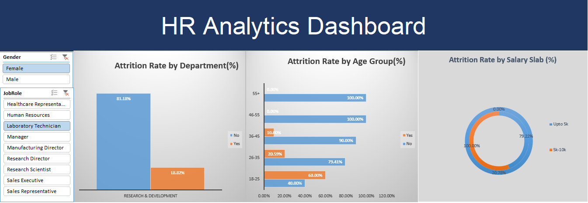

# HR Analytics Interactive Dashboard 📊

## 📌 Project Overview
This project focuses on analyzing employee attrition and identifying the key factors driving turnover within the organization. By cleaning and modeling a comprehensive HR dataset, I developed an interactive Excel Dashboard that allows stakeholders to explore attrition trends based on various demographics and job roles.

## 🎯 Key Objectives
*   Analyze overall employee attrition rates.
*   Investigate the impact of **Age**, **Department**, and **Salary Slabs** on employee retention.
*   Provide an interactive and user-friendly interface for HR managers to filter data dynamically.

## 🛠️ Tools & Techniques Used
*   **Microsoft Excel:** Data Cleaning, Handling Missing Values (NULLs).
*   **Data Modeling:** Structuring raw data using Excel Tables.
*   **Data Analysis:** Utilizing **Pivot Tables** to aggregate and calculate percentage-based turnover rates.
*   **Data Visualization:** Designing clean, minimalist **Pivot Charts** (Bar, Column, Doughnut).
*   **Interactivity:** Implementing **Slicers** connected to multiple charts for dynamic filtering (e.g., by Gender and Job Role).

## 💡 Key Insights
1.  **Sales and HR** departments experience the highest proportional turnover rates.
2.  Younger talent (Age **18-25**) shows the highest risk of attrition compared to other age groups.
3.  As expected, employees in the lowest **Salary Slab (Upto 5k)** have a significantly higher tendency to leave the company.

*(Note: Check the uploaded video/screenshot to see the interactive dashboard in action!)*
